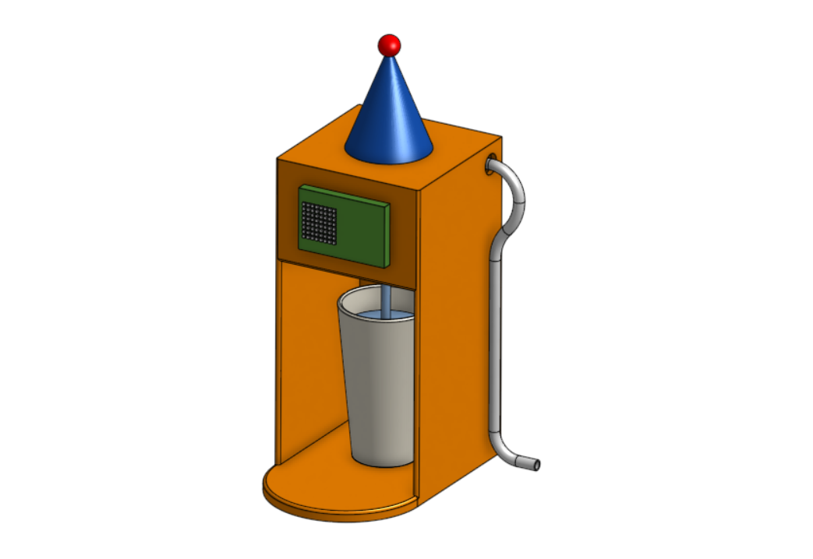
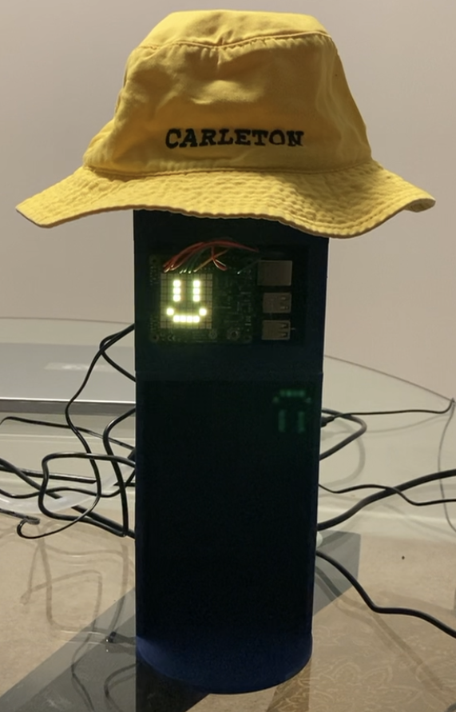

# SYSC 3010 - Term Project - The WaterBuddy
Group: L3_G7  
TA: Roger Selzer  
### Group Members
  - Michael Marsland - Computer Systems Engineering
  - Nick Milani - ...
  - Caleb Turcotte - ...

## The WaterBuddy
The Original Design Idea for the WaterBuddy

The Completed WaterBuddy Station

## Project Summary
The purpose of this project was to create a smart desk-mounted watering station
"""Copy the text from the proposal, or design draft?)"""

## Repository Structure
### [Smartphone Application](Application/WaterBuddy)
  - This folder contains...
### [Main Application Code](Application/WaterBuddy/app/src/main/java/com/application/waterbuddy)
  - ...
### [Application Layout](Application\WaterBuddy\app\src\main\res\layout)
  - ...
### [Applicaation Tests](Application\WaterBuddy\app\src\test\java\com\application\waterbuddy)
  - ...
 

### [WaterBuddy Station](WaterBuddy)
This folder contains all of the code for The WaterBuddy station itself as well as the 
WaterBuddy simulator (WaterBuddy Minus).
### [Simulators](WaterBuddy/Simulators/)
The code required to mimic the WaterBuddy fill functionality and implement the buzzer
interface for the WaterBuddy Minus. This allows the station to be set up as a simulator
and run with just a Raspberry Pi and SenseHat.
### [Tests](WaterBuddy/Tests)
All the tests for the WaterBuddy station are stored here. This includes all unit tests
for the hardware as well as the WaterBuddy software.
### [Weekly Updates](WeeklyUpdates)
The groups weekly progress updates are maintained here for an overview of which team
member completed each part of the project and how we progressed over the term.

## Installation Instructions
### WaterBuddy Minus
In order to set up a WaterBuddy Simulator you will require a RaspberryPi with an attached
SenseHat Module. With just these components you can set-up a WaterBuddy Minus which allows
you to participate in the system without needing to buy all the additional fill-system hardware.

In order to set up the WaterBuddy Minus, clone this repository to your Raspberry Pi. Then in the file:
[waterbuddy.py](WaterBuddy/waterbuddy.py) you can edit line 261 to give your station an ID and set it
as a simulator.
    water_buddy = WaterBuddy("[your-desired-station-ID-here]", simulator=True)

You will be required to install python3 and the following python libraries:
  - pyrebase
        pip install Pyrebase

Finally, you can start the station by running waterbuddy.py
    python3 waterbuddy.py

## Running Instructions / User Instructions (How to use the system/What they should see)
### WaterBuddy Minus
Once the WaterBuddy Minus system is installed and running you should see a welcome message.
You can then create an account on the app and register the station to yourself using
"[your-desired-station-ID-here]" established earlier. Once the station belongs to you, you
can use it in the same way as the main WaterBuddy station. The only difference is that you
will have to fill your water glass yourself and press the senseHat joystick in whenever you
finish your glass of water to allow the system to track your progress.

 

 

## REQUIREMENTS (Remove this once done...)
Some required elements for your top-level Readme.md file:

Everything from one of your project report title pages (Group number, your names (no student ID here please), project title, project image, TA name, course code)
A summary of what the project is about (~200 words)
A description of your repo. What is the directory structure and what is (generally) in each top-level directory (test code, GUI, code for RPi1 that drives the car, etc)
Installation instructions (how could someone get your project up and running if they bought all the hardware?)
How to run your system (start this code on RPi1, then launch this code on the AWS server, then initialize...)
How someone will know that their installation is working correctly ("you should see...", or "running these tests should all pass", or...)
